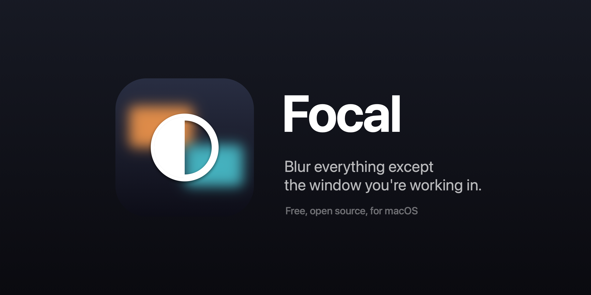
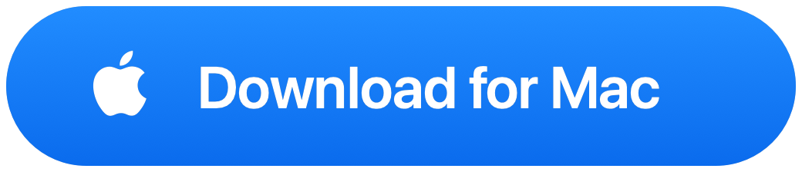
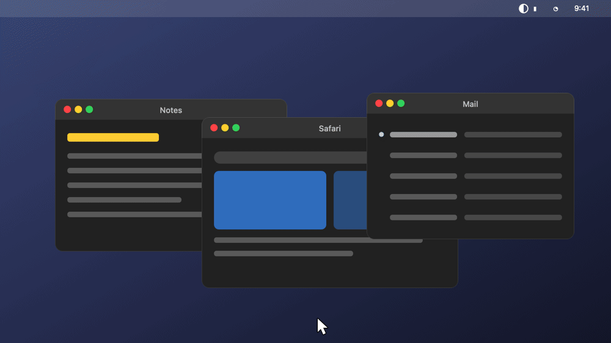
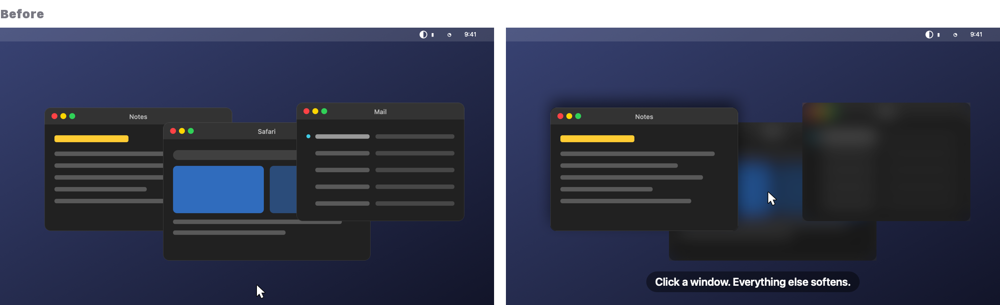
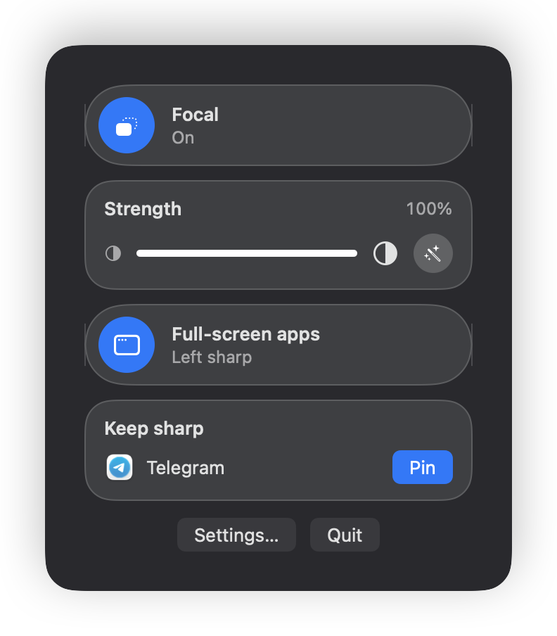
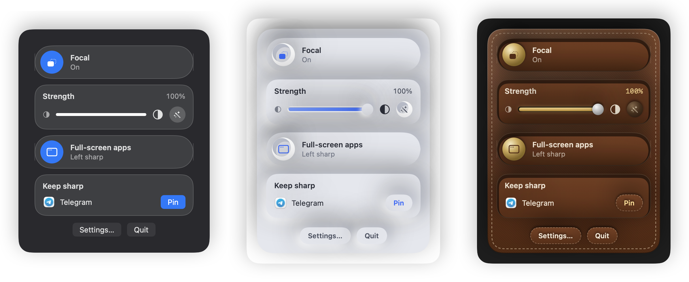
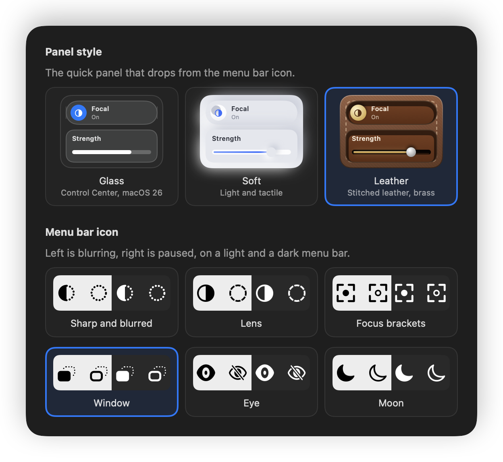
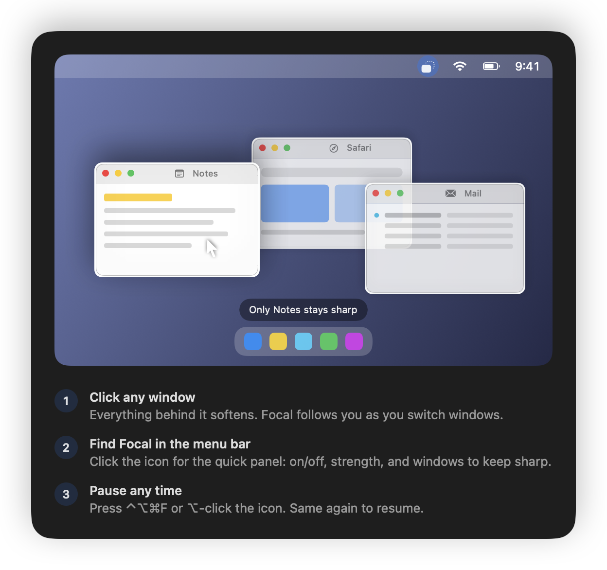

<p align="center"></p>

<h3 align="center">The window you're using stays sharp. Everything else softens.</h3>

<p align="center">
  <a href="https://github.com/maka-tanmay/focal/releases/latest/download/Focal.zip"></a>
</p>
<p align="center">
  
  
  
  <a href="LICENSE"></a>
</p>

<p align="center"></p>

<br>

<p align="center"></p>

<br>

## One click, and it's on

<p align="center"></p>

Focal lives in your menu bar. Click the icon, flip the switch. Slide the strength from a light haze to a full frost, or let **Auto** decide. Need a second window sharp next to your work? **Pin** it.

<br>

## Pick a look

<p align="center"></p>

<p align="center"><sub>Glass · Soft · Leather</sub></p>

<p align="center"></p>

<br>

## It shows you around

<p align="center"></p>

<br>

## Get Focal

**1.** [Download](https://github.com/maka-tanmay/focal/releases/latest/download/Focal.zip) and open the zip.
**2.** Drag **Focal** into **Applications** and open it.
**3.** First time only, your Mac says it can't verify the developer. Click **Done**, open **System Settings → Privacy & Security**, scroll down, click **Open Anyway**.

Done. Focal is in your menu bar.

<details>
<summary>Skip step 3 with one line in Terminal</summary>
<br>

```bash
curl -fsSL https://raw.githubusercontent.com/maka-tanmay/focal/main/install.sh | sh
```
</details>

<br>

<details>
<summary><b>Good to know</b></summary>
<br>

- **Full-screen apps are left alone.** Swipe to a movie or a game and Focal steps aside. There's a switch if you want it to blur there too.
- **Two screens?** Your window stays sharp, both screens blur behind it.
- **Pause anywhere** with ⌃⌥⌘F, or ⌥-click the icon. Record your own shortcut in Settings.
- **Nothing to worry about.** Focal never reads your screen, never goes online, and asks for no permissions. It only asks macOS where the windows are.
- **Light on your Mac.** One blur layer, the same kind macOS uses for its own menus.
</details>

<br>

<p align="center"><sub>Made by <a href="https://github.com/maka-tanmay">Tanmay Maka</a> · Inspired by <a href="https://www.heyiam.dk/monocle">Monocle</a> · <a href="https://github.com/maka-tanmay/focal/issues">Something off? Tell us</a> · <a href="BUILDING.md">Under the hood</a></sub></p>
