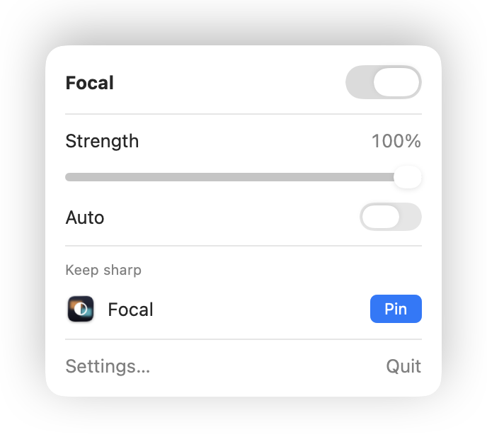
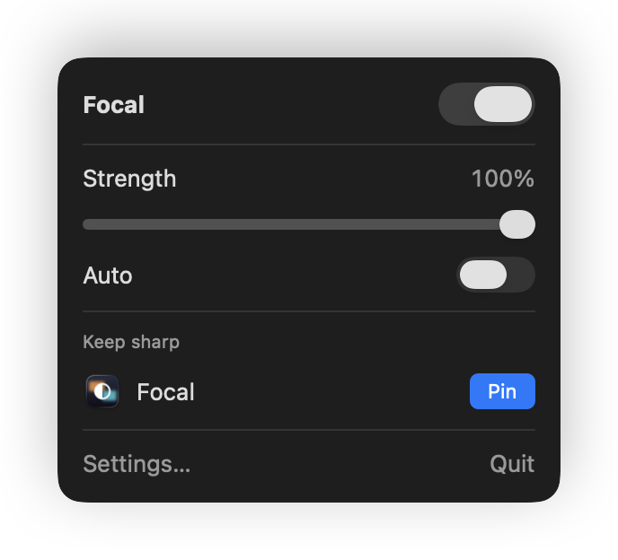
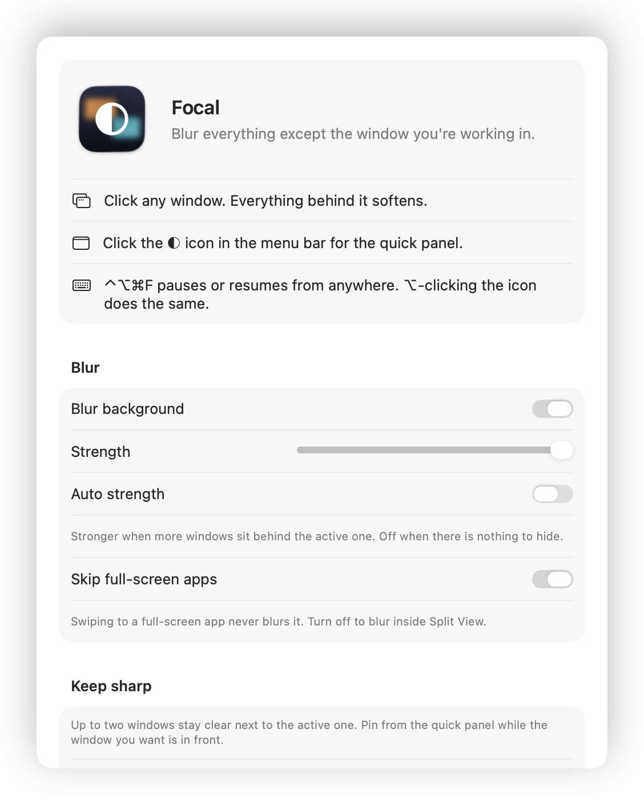
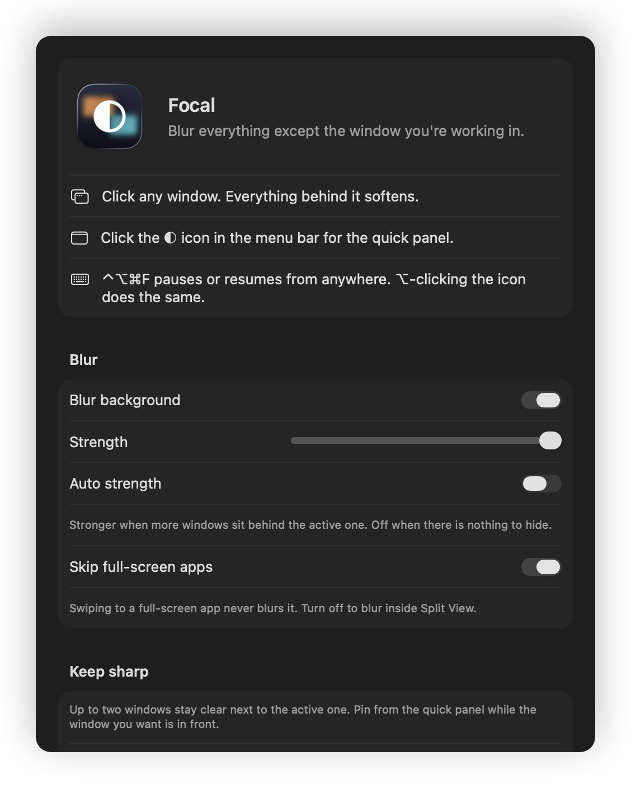

<p align="center"></p>

# Focal

**Blur everything except the window you're working in.** A free, open-source macOS menu bar app.

Click a window and everything behind it softens into a blur. Switch windows and the focus follows. No account, no permissions dialog, no Dock icon.

## Install

Paste this in Terminal:

```bash
curl -fsSL https://raw.githubusercontent.com/maka-tanmay/focal/main/install.sh | sh
```

That downloads the latest release into `/Applications` and launches it. Look for the ◐ icon in your menu bar.

Prefer clicking? Grab `Focal.zip` from the [latest release](https://github.com/maka-tanmay/focal/releases/latest), unzip, drag to Applications. Because the app isn't notarized, the first launch needs **right-click → Open**.

Requires macOS 13 or later. Universal binary (Apple Silicon and Intel).

## Use

Focal opens its Settings window the first time it runs and explains itself there. After that it lives in the menu bar.

- **Click the ◐ icon** for the quick panel: on/off switch, strength slider, Auto, and pins for windows to keep sharp.
- **⌥-click the icon** or press **⌃⌥⌘F** to pause or resume instantly. Both the shortcut and the icon style can be changed in Settings.
- **Settings…** in the panel opens the full window: every option, launch at login, and About. Focal shows a Dock icon only while that window is open.
- **Auto** lets Focal pick the strength: stronger the more windows sit behind the active one, off when there is nothing to hide.
- **Keep sharp** pins up to two extra windows that stay clear next to the active one. Open the panel while the window you want is in front and click Pin.
- Full-screen apps are left alone unless you turn that off in Settings. Works across multiple displays and Spaces.

## Screenshots

<p align="center">
  
  
</p>
<p align="center">
  
  
</p>

## How it works

One borderless window per display holds an `NSVisualEffectView` with behind-window blending. Every 150 ms Focal reads the on-screen window list, finds the frontmost app's frontmost normal window, and orders the blur window directly beneath it. Everything above stays sharp, everything below gets blurred. That's the whole trick, in about 200 lines of Swift.

No Accessibility or Screen Recording permission is needed because the window list and window ordering are public APIs.

## Build from source

```bash
git clone https://github.com/maka-tanmay/focal && cd focal && ./build.sh
open build/Focal.app
```

Needs Xcode command line tools. Releases are built by GitHub Actions on every `v*` tag.

## Credits

Inspired by [Monocle](https://www.heyiam.dk/monocle) by Dominik Kandravy, and the window-ordering approach in [dimsum](https://github.com/nshi/dimsum). MIT licensed.
